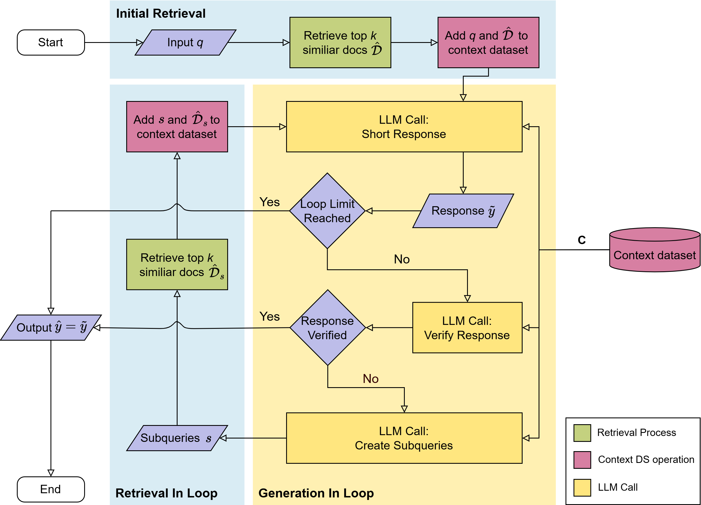
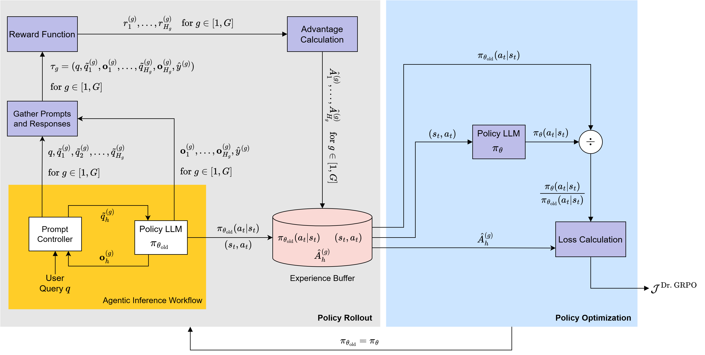

# Retrieval-Augmented Generation for Multi-Hop Question Answering

Master's thesis project at TU Braunschweig (IFN). Implements and evaluates a multi-hop RAG pipeline with GRPO-based LLM fine-tuning for complex question answering.

---

## Overview

Standard RAG pipelines retrieve documents once and generate an answer in a single pass. This fails for **multi-hop questions** that require chaining information across multiple documents. This project addresses that by:

1. Implementing an **iterative retrieval-and-reasoning loop** where the model dynamically issues sub-queries, retrieves documents, and checks whether it has enough information before producing a final answer.
2. Adapting **Group Relative Policy Optimization (GRPO)** to fine-tune the LLM across entire multi-hop reasoning trajectories — not just single-step responses.

---

## Results

Evaluated on subsets of [HotpotQA](https://hotpotqa.github.io/) (medium + hard questions):

| Pipeline | Exact Match | F1 |
|---|---|---|
| One-hop baseline | 23.5% | 31.3% |
| Multi-hop baseline (no fine-tuning) | 25.9% | 34.3% |
| **Multi-hop + GRPO fine-tuning** | **30.6%** | **39.8%** |

- **+7.1% Exact Match** over one-hop baseline
- **+4.7% Exact Match** over non-fine-tuned multi-hop baseline

---

## Pipeline Architecture

### Multi-hop inference loop

The pipeline has three components: an initial retrieval step, then an iterative loop alternating between generation sub-tasks (Short Response, Verify Response, Create Sub-queries) and retrieval. The loop terminates either when the response is verified or a loop limit is reached.

### GRPO adaptation

Standard GRPO was modified to operate over full multi-hop trajectories. Each trajectory consists of multiple prompt-response pairs across loop iterations. Rewards and advantages are calculated per output step and propagated back across all tokens in that step.

---

## Tech Stack

| Component | Choice |
|---|---|
| LLM | Qwen3-4B (non-thinking mode) |
| Embedding model | all-MiniLM-L6-v2 |
| Vector database | FAISS (IVF index, ~14M sentence vectors from Wikipedia) |
| Fine-tuning | TRL (GRPOTrainer, extended for multi-hop) + LoRA adapters |
| Structured generation | Outlines (regex-constrained decoding) |
| Dataset | HotpotQA (medium + hard splits) |

---

## Reward Design

| Reward | Description | Applied at |
|---|---|---|
| Exact Match (EM) | Binary match after normalization | Trajectory level |
| F1-score | Token overlap with gold answer | Trajectory level |
| Formatting consistency | Penalty for invalid output structure | Step level |
| Document Retrieval Score | Recall of gold supporting documents | Trajectory level |
| Loop Exit Decision Score | Correctness of verify-response decisions | Trajectory level |
| Length Regularization | Exponential penalty for verbose responses | Trajectory level |

---
## Reference

Full thesis available on request. Supervised by Patrick Blumenberg, M.Sc. under Prof. Dr.-Ing. Tim Fingscheidt, Institute for Communications Technology, TU Braunschweig.
